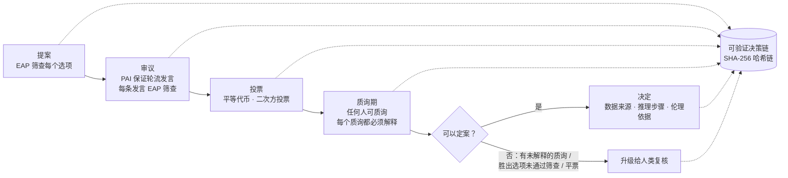
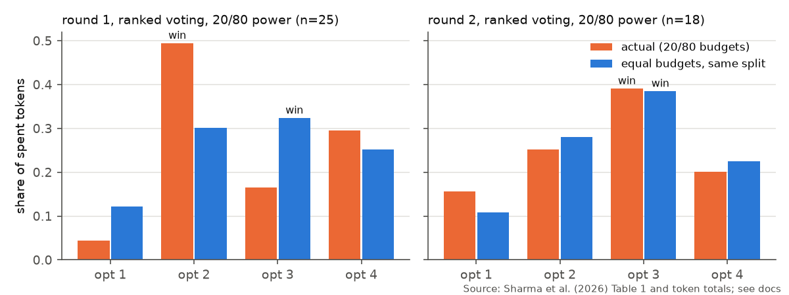
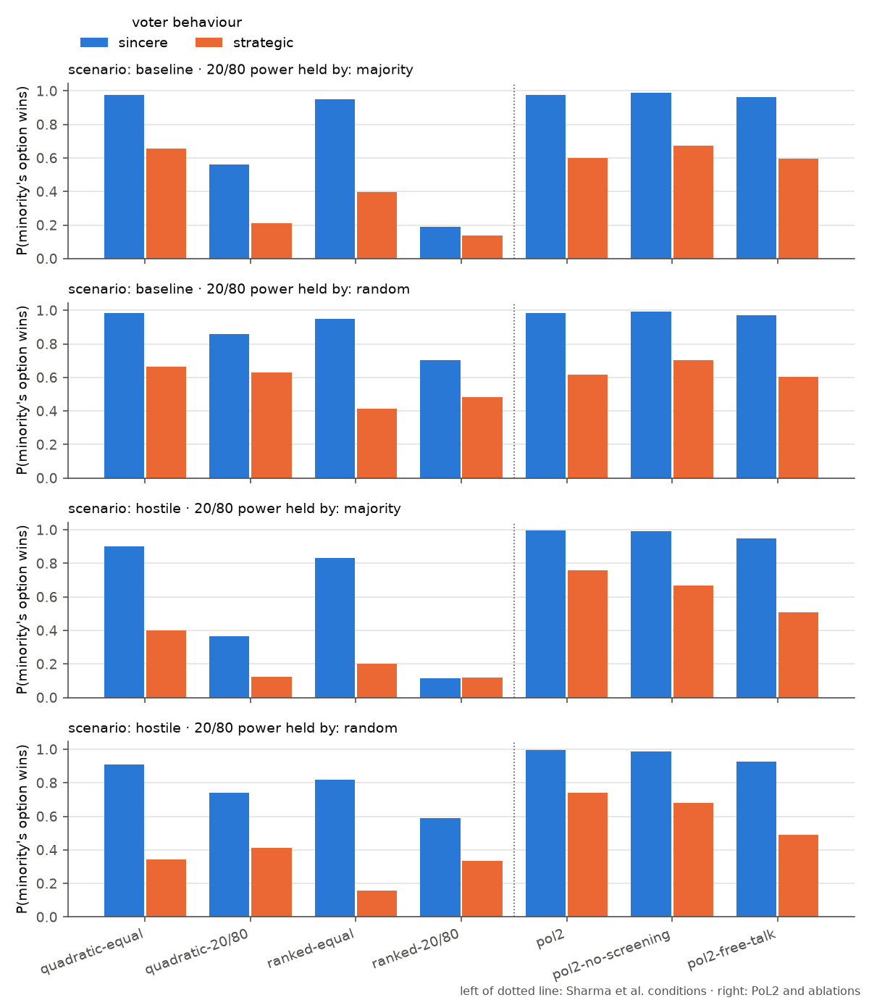

<div align="center">

# 🌿 PoL2 × DAO：爱2证明的 AI 治理实验室

**把「爱2证明（Proof of Love2）」的治理条款，落到一个可运行、可检验的 DAO 投票与审议流程上**

[简体中文](README.md) · [English](README.en.md)

[](.github/workflows/ci.yml)
[](pyproject.toml)
[](LICENSE)

</div>

---

## 这是什么

本仓库把两样东西接在一起：

| 来源 | 提供了什么 |
|---|---|
| **爱2证明（PoL2）**，[NaturalDAO](https://github.com/naturaldao/NaturalDAO) 的基础理论 | 治理的**价值与条款**：平等联结、扬爱抑恨、「非爱非恨」的不在场状态、可验证决策链路、人类的建议权与质询权 |
| **Sharma et al. (2026)** 的 DAO 实验，*Scientific Reports* 16, 11792（[独立复现](https://github.com/shentonyan/dao-governance-replication)） | 治理的**机制与数据**：人们用代币就「AI 模型该怎么做」投票，比较二次方投票 vs 排序投票、平等权力 vs 20/80 权力 |

PoL2 讲清楚了「应该怎样」，但没有给出可以运行的机制；DAO 实验给出了机制和真实选票，但没有伦理层。本仓库把 PoL2 的每一条相关条款翻译成**一段代码 + 一个可检验的指标 + 一个测试**，然后回答一个具体问题：

> **在 AI 治理 DAO 里加入 PoL2 的平等联结与扬爱抑恨，会怎样改变谁的声音被听见、谁的选择胜出？**

核心代码只用 Python 标准库，零依赖；画图需要 matplotlib（可选）。

## 一次 PoL2 治理会话长什么样



每一步都追加到一条哈希链上，改动任何一条历史记录都会被 `pol2dao verify` 发现。

## PoL2 条款 → 机制 → 代码

| PoL2 条款（PoLEn） | 在本仓库里是什么 | 模块 |
|---|---|---|
| 4.3.1 平等联结：人人平等，**只评判行为不评判人** | 平等代币预算；筛查接口只接收文本，不接收发言者 | `voting.py` `eap.py` |
| 4.3.3 PAI 保证「严格轮流发言，不垄断对话」 | 轮流发言主持；被标记的人**发言权不变** | `deliberation.py` |
| 4.3.2 扬爱抑恨；批评、愤怒、反对**不是**恨 | 爱 / 恨 / 不在场三值判定 + 修复提示，而非删帖 | `eap.py` |
| 4.3.2「非爱非恨」的不在场状态 | 第三个判定值 `absence`，不强迫二选一 | `eap.py` |
| 第七章 第 4、5 条：公开透明、可验证决策链路 | 追加式哈希链，记录数据来源、推理步骤、伦理依据 | `ledger.py` `protocol.py` |
| 第七章 第 9 条：质询权与解释义务 | 质询从不被拦截；未解释的质询阻止定案 | `protocol.py` |
| 文献综述结论：阈值要本地拟合，升级链末端必须是人 | `fit_threshold()`；不确定区间 → `escalate` | `eap.py` |

完整对照（含每条的测试、尚未解决的张力）见 [docs/concept-mapping.md](docs/concept-mapping.md)。

## 快速开始

```bash
git clone https://github.com/shentonyan/pol2-dao-governance.git
cd pol2-dao-governance
python -m venv .venv
source .venv/bin/activate          # Windows PowerShell: .venv\Scripts\Activate.ps1
pip install -e ".[dev]"

pol2dao demo                       # 跑一次完整的 PoL2 治理会话，写出决策链
pol2dao verify results/demo_decision_chain.jsonl
pol2dao published                  # 用论文公布的数字做「平等预算」反事实
pol2dao simulate --reps 1000       # 主模拟：4 个论文条件 + PoL2 + 消融（约 30 秒）
pol2dao experiments --reps 1000    # 全部 14 个实验 E0–E13，生成全部图表（约 3 分钟）
pytest                             # 54 个测试
```

有 OSF 原始数据（<https://osf.io/q6snh/>，本仓库不附带）时，可以逐张选票重放：

```bash
pol2dao replay --data-dir path/to/osf-files      # 含 bootstrap 稳定性
```

### 在代码里使用

```python
from pol2dao import GovernanceSession, GovernanceConfig, Proposal

s = GovernanceSession(Proposal("P-1", "AI 应该记住用户偏好吗？", ("不记住", "记住")),
                      ["ada", "bo", "chen"], GovernanceConfig.pol2())
s.say("ada", "谢谢大家，我们一起看看代价。")
s.say("bo", "我很生气，我反对记住偏好。")          # 愤怒 + 反对：通过，不是恨
s.say("chen", "Anyone who disagrees is an idiot.")   # 被标记 + 修复提示；chen 下一轮照常发言
s.open_vote()
s.cast("ada", (36, 64)); s.cast("bo", (100, 0)); s.cast("chen", (0, 100))
s.close_vote()
q = s.question("chen", "为什么这样计票？")
s.explain(q, "二次方投票：t 个代币换 √t 票。")
print(s.finalize().to_dict())
```

想换成真正的模型（大语言模型、Jev 类判定模型、安全分类器）？用 `CallableJudge` 包一层即可，见 [examples/custom_judge.py](examples/custom_judge.py)。

## 结果

### 1. 真实数据：20/80 权力改变了一次投票的结果

只用论文公布的数字（Table 1 的平均预算份额和每个选项的代币总数）就能算出：**如果每个人预算相同、分配比例不变**，排序投票条件下的结果会不会变。对排序（线性）投票这个计算是精确的。



| 条件 | 实际胜出 | 平等预算下胜出 | 第一与第二的差距 |
|---|---|---|---|
| 第 1 轮 · 排序 · 20/80（n=25） | 选项 2（49.5 % 的代币） | **选项 3** | 0.021 |
| 第 2 轮 · 排序 · 20/80（n=18） | 选项 3 | 选项 3 | 0.103 |

两个 20/80 排序条件中有一个结果翻转。**要谨慎解读**：差距只有 0.021，25 人样本下这在抽样误差之内；而且假设人们在预算相同时会用同样的比例分配。要看稳定性，请用 `pol2dao replay` 对 OSF 原始选票做 bootstrap。二次方条件无法仅从平均数计算。

### 2. 模拟：哪个机制在起作用

模型设定：25 人，20 % 少数派强烈偏好选项 3，多数派温和偏好选项 2；按人头平等计算的最优选项是 3。比较论文的 4 个条件、PoL2 以及两个「拆掉一部分」的对照（消融）。每格 1000 次。



在这个模型里（策略型投票者）：

| 发现 | 数字 |
|---|---|
| **权力集中在多数派时，平等权力是最大的杠杆** | 排序投票：平等 0.40 → 20/80 0.14；二次方：0.66 → 0.21 |
| 二次方投票比排序投票更能反映强烈偏好 | 平等权力下 0.66 vs 0.42 |
| 有敌意发言时，**轮流发言**恢复了少数派的发言份额 | 0.12 → 0.20；胜出概率 0.34–0.40 → 0.67–0.68 |
| EAP 筛查在此基础上再加一点 | → 0.74–0.76（仍有约 20 % 的敌意发言漏检） |
| **没有敌意时，筛查反而伤害少数派** | 0.67–0.70 → 0.60–0.62：被误标的正是少数派的批评 |

最后一行最重要：**安全阀的误报，由它本来要保护的人承担。** 这与 PoL2 的要求（批评不是恨）和 PoL2-Jev 文献综述的负面结果一致——筛查必须有人类复核和本地校准，不能直接删帖。E4、E5 进一步说明：误报本身不致命，致命的是误报**偏向**异见。

> ⚠️ 这是一个**模型**，不是关于真实人群的证据。所有行为假设都是 `Scenario` 的参数，列在 [docs/experiment-design.md](docs/experiment-design.md)。模拟的用途是理清机制之间的相互作用、为真实实验设计假设。

### 3. 实验图集：14 个实验 E0–E13

所有图表都遵循统一的[制图规范](docs/figure-style.md)（参照 [figures4papers](https://github.com/ChenLiu-1996/figures4papers)）：
- 颜色语义固定：蓝 = PoL2，红 = 论文里的二次方投票基线，灰 = 论文里的排序投票基线，绿 = 变体；
- 虚线和斜线阴影表示 20/80 权力集中；
- 阴影带和误差棒是 95 % 置信区间；
- ↑ / ↓ 标明指标越高越好还是越低越好；
- 每张图同时有 PNG（300 dpi）和矢量 PDF。

每个实验的设定、数字和局限写在 **[docs/results.md](docs/results.md)**。下面是主要图表。

#### 每个机制各贡献多少（E0）

从论文里最差的条件出发，每次加一个 PoL2 机制。没有敌意时，主要贡献来自平等权力与二次方投票；有敌意时，最大的一步是轮流发言（+0.33）。

#### 结论在多大范围内成立（E1）

恐吓越强、敌意越多，PoL2 的优势越大（最高 +0.86）；没有敌意时略有代价；说服力为 0 时两者没有区别。

#### 偏好强度 · 规模（E2、E3）


排序投票几乎不随偏好强度变化；组越大，20/80 越压倒少数派（n = 100 时少数派胜出概率 0.01），而 PoL2 下升到 0.91。少数派只占 10 % 时，什么机制都救不了。

#### 安全阀：要多准、会不会偏（E4、E5）


判定器 AUROC 低于约 0.8 时几乎没有收益；如果它把少数派的批评当成恨语，超过 1.5σ 的偏见就会让「有筛查」比「不筛查」更差。

#### 女巫攻击 · PAI 自主决策 · 声音的消失（E6–E8）


一人多号能击穿二次方投票，所以「人人平等」需要人格证明。PAI 自主决策（第七章第 2 条）在大家都诚实时几乎完美，但只要 20 % 的人夸大偏好，它就不再比二次方投票好。自由发言时，少数派的声音在第一轮内就下降，只有轮流发言能一直保持公平份额。

#### 筛查器评测：NaturalDAO 公开试例 · 双语压力测试（E9、E10）


在 NaturalDAO PoL-Governance 的 20 条公开试例上，盲测版词表的召回率是 0 %：PoL2 所说的违规（不诚实、越过同意边界、工具滥用）远比恨语宽。压力测试显示，否定、引用、变形拼写、隐晦敌意是关键词方法的盲区。

#### 真实数据 · 决策链 · 文献地图（E11–E13）


第 1 轮「二次方 + 20/80」中，代币份额领先的是选项 4，但按二次方规则胜出的是选项 3：规则本身抵消了权力集中造成的影响。决策链验证 10,000 条记录约需 40 ms，篡改会被精确定位到被改的那一条。

## 目录结构

```
pol2-dao-governance/
├── src/pol2dao/
│   ├── eap.py            伦理对齐协议筛查：爱/恨/不在场三值判定、路由、阈值拟合
│   ├── deliberation.py   审议：轮流发言、发言平等度
│   ├── voting.py         选票、线性/二次方/多数计票、平等与 20/80 权力
│   ├── metrics.py        基尼系数、中本聪系数、平等权重遗憾值
│   ├── ledger.py         可验证决策链（SHA-256 哈希链）
│   ├── protocol.py       一次完整的 PoL2 治理会话
│   ├── simulate.py       基于智能体的模拟（含合成判定器、女巫攻击、发言轨迹）
│   ├── autonomy.py       PAI 自主决策（第七章第 2 条）
│   ├── replay.py         用真实选票做平等预算反事实
│   ├── experiments/      E0–E13 实验套件（机制、筛查、自主决策、判定器评测、数据）
│   ├── plotstyle.py      制图规范的唯一实现（调色板、字体、导出）
│   ├── figures.py        作图（可选）
│   ├── demo.py  cli.py
├── data/
│   ├── sharma2026_*.csv       论文公布的汇总数字
│   ├── eap_stress_corpus.csv  96 句双语压力测试语料（本仓库编写）
│   └── external/              NaturalDAO 的 CC0 数据：公开试例、文献综述
├── results/              生成的表格（18 个 CSV）、图（17 张，每张 PNG + PDF）和示例决策链
├── examples/             自定义判定模型示例
├── tests/                54 个测试（含制图规范检查）
├── CLAUDE.md             项目记忆：给 Claude Code 等编程助手的约定（含制图规范）
└── docs/
    ├── results.md             实验结果图集（E0–E13）
    ├── figure-style.md        制图规范
    ├── concept-mapping.md     PoL2 条款 ↔ 机制 ↔ 代码 ↔ 测试
    ├── experiment-design.md   研究问题、模型假设、指标、局限、下一步真实实验
    └── upload-to-github.md    如何上传到你自己的 GitHub
```

## 局限（请先读这里）

- `LexiconJudge` 是一个**透明的占位基线**（关键词规则），不是经过验证的分类器。它会漏检不带关键词的敌意，也会误标「This stupid default…」这类对事不对人的粗话。真实部署请接入模型，并按本地数据用 `fit_threshold()` 校准。
- 这里的「PAI」是一段确定性的程序，不是 AI。PoL2 第七章第 2 条设想 NaturalDAO 无需人类投票即可自主决策；本仓库保留人类投票作为输入，并在 E7 中把两者放在一起比较——这一张力写在 [docs/concept-mapping.md](docs/concept-mapping.md#尚未解决的问题)。
- `LexiconJudge.v1()` 是在读过 NaturalDAO 公开试例之后补充的，它在这 20 条试例上的结果**不是盲测**。
- 没有实现人格证明（防女巫）。E6 表明它是平等联结的前置条件。
- 决策链目前把选票以化名公开记录。真实部署需要隐私设计（如承诺-揭示、零知识证明）。
- 平等预算反事实假设人们的分配比例不随预算变化。

## 致谢与引用

- 爱2证明：[NaturalDAO](https://github.com/naturaldao/NaturalDAO)（CC0-1.0）。公开试例与文献综述数据来自其 `PoL-Governance/` 目录（CC0），复制于 commit `30f1ad6`。
- DAO 实验：Sharma, T. et al. *Democratic governance through DAO-based deliberation and voting for inclusive decision making in AI models.* Scientific Reports 16, 11792 (2026). <https://doi.org/10.1038/s41598-026-40180-8>。数据：<https://osf.io/q6snh/>。
- 汇总数字的复现：[dao-governance-replication](https://github.com/shentonyan/dao-governance-replication)。
- 引用本仓库：见 [CITATION.cff](CITATION.cff)。

本仓库与上述作者无隶属关系。代码以 MIT 许可发布（见 [LICENSE](LICENSE)）；数据与论文遵循各自的条款。
