# 实验结果图集（E0–E13）

本页收录全部 14 个实验：每个实验的问题、设定、图、发现和不能说明什么。所有图表和数据都由下面这条命令生成，写入 `results/figures/` 与 `results/tables/`：

```bash
pip install -e ".[plot]"
pol2dao experiments --reps 1000          # 全部，约 2–3 分钟
pol2dao experiments --only E4,E5         # 只跑其中几个
```

**读图约定**（[制图规范](figure-style.md)）：
- 蓝 = pol2，红 = 论文里的二次方投票，灰 = 论文里的排序投票，绿 = 变体；
- 虚线和斜线阴影表示 20/80 权力集中；
- 阴影带和误差棒是 95 % 置信区间（蒙特卡洛误差）；
- ↑ / ↓ 表示指标越高越好或越低越好；
- 图内不放脚注，设定和注意事项写在每节的文字里；
- 每张图在 `results/figures/` 下都有同名的矢量 PDF。

> ⚠️ **E0–E8 是模型模拟，不是关于真实人群的证据。** 模型假设见 [experiment-design.md](experiment-design.md)。E9、E10 评估的是一个关键词基线，不是经过验证的分类器。只有 E11 使用真实实验数据（论文公布的汇总数字）。

默认设定（除非另有说明）：每组 25 人，其中 20 % 是少数派，少数派强烈偏好选项 3，多数派温和偏好选项 2。按人头平等计算，选项 3 是最优选项。「hostile」场景中，多数派 30 % 的发言带有敌意。策略型投票者：排序投票时全押首选，二次方投票时按最优公式分配。

| 编号 | 问题 | 图 |
|---|---|---|
| E0 | PoL2 的每个机制各贡献多少？ | [e0](../results/figures/e0_mechanism_decomposition.png) |
| E1 | 结论对恐吓强度、说服力、敌意比例是否稳健？ | [e1](../results/figures/e1_sensitivity_heatmaps.png) |
| E2 | 少数派的偏好要多强，各规则才会让它胜出？ | [e2](../results/figures/e2_preference_intensity.png) |
| E3 | 组越大、少数派越少，会怎样？ | [e3](../results/figures/e3_scale.png) |
| E4 | 筛查器要多准、阈值怎么设，才划算？ | [e4](../results/figures/e4_judge_operating_point.png) |
| E5 | 筛查器把「反对」误当「恨」，会怎样？ | [e5](../results/figures/e5_judge_bias.png) |
| E6 | 女巫攻击（一人多号）能否击穿二次方投票？ | [e6](../results/figures/e6_sybil_attack.png) |
| E7 | PAI 不经投票自主决策（第七章第 2 条）能否替代投票？ | [e7](../results/figures/e7_pai_autonomy_vs_voting.png) |
| E8 | 审议过程中，少数派的声音是怎样消失的？ | [e8](../results/figures/e8_voice_dynamics.png) |
| E9 | 基线筛查器在 NaturalDAO 公开试例上表现如何？ | [e9](../results/figures/e9_pilot_benchmark.png) |
| E10 | 基线筛查器在哪些句子上失败？ | [e10](../results/figures/e10_stress_corpus.png) |
| E11 | 论文的真实数据整体是什么样？ | [e11](../results/figures/e11_published_overview.png) |
| E12 | 决策链的成本，以及能否定位篡改？ | [e12](../results/figures/e12_decision_chain.png) |
| E13 | PoL2-Jev 文献综述的七条轴线，本仓库各用什么回应？ | [e13](../results/figures/e13_literature_map.png) |

---

## E0 机制分解：从论文最差的条件一步步走到 PoL2

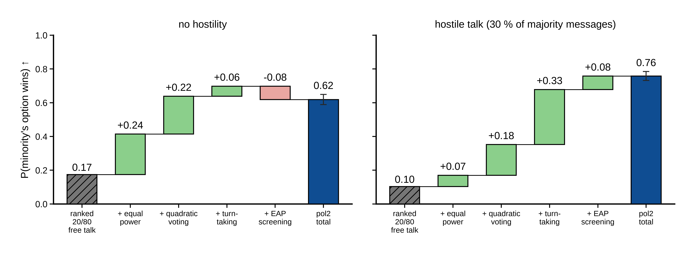

**设定**：起点是「排序投票 + 20/80 权力（握在多数派手里）+ 自由发言」，然后每次加一个机制：平等权力 → 二次方投票 → 轮流发言 → EAP 筛查。策略型投票者，每一步 1000 组。绿色柱表示这一步带来收益，浅红柱表示损失，最右边的深蓝柱是 pol2 的最终结果（带 95 % 置信区间）。

**发现**

| 步骤 | 无敌意 | 有敌意 |
|---|---:|---:|
| 排序 · 20/80 · 自由发言 | 0.17 | 0.10 |
| + 平等权力 | 0.41 | 0.17 |
| + 二次方投票 | 0.64 | 0.35 |
| + 轮流发言 | 0.70 | 0.68 |
| + EAP 筛查（= pol2） | **0.62** | **0.76** |

- 没有敌意时，**平等权力（+0.24）和二次方投票（+0.22）**贡献最大；筛查反而带来 −0.08 的损失（原因见 E4、E5）。
- 有敌意时，最大的一步是**轮流发言（+0.33）**：敌意压低了少数派的发言，轮流发言把发言权还了回来。
- **机制的价值取决于环境**：没有哪一个机制在所有场景下都有益。

## E1 敏感性：结论在多大范围内成立

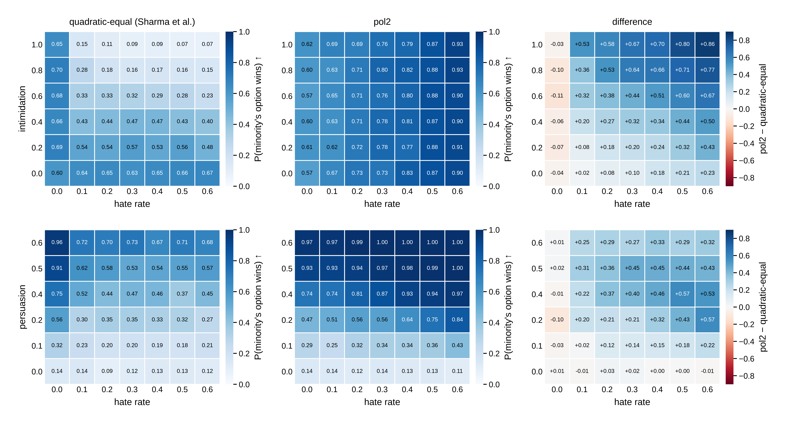

**设定**：在「敌意比例 × 恐吓强度」和「敌意比例 × 说服力」两个网格上，比较 quadratic-equal（论文条件）和 pol2。策略型投票者，权力握在多数派手里，每格 400 组。右列是两者之差（蓝 = pol2 更好，红 = pol2 更差）。

**发现**

- 只要存在敌意（敌意比例 ≥ 0.1）且有恐吓效应（≥ 0.2），pol2 的优势就在 +0.08 到 +0.86 之间，**恐吓越强，优势越大**。
- 敌意比例为 0 的那一列，pol2 略差（−0.03 到 −0.11）：这就是 E0 里筛查带来的代价。
- 说服力为 0 时两者没有区别（都在 0.09–0.14 之间）：在这个模型里，PoL2 的作用完全**通过审议**实现。如果人们在审议中不会被说服，发言平等就不会改变投票结果。

## E2 偏好强度：少数派要多「在乎」才能赢

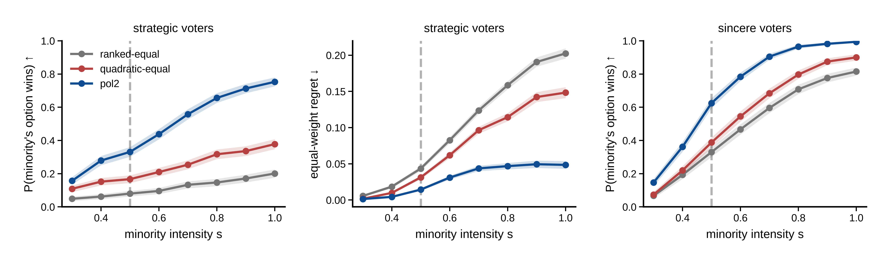

**设定**：少数派效用 = (0, 0, s, 0.2s)，s 从 0.3 增加到 1.0。场景有敌意，权力握在多数派手里。虚线右侧，少数派的首选同时也是平等权重下的最优选项。

**发现**

- 策略型投票者：s = 1 时，排序投票 0.20，二次方投票 0.38，pol2 0.75。
- 排序投票几乎不随偏好强度变化，因为它只看「选谁」，不看「多在乎」。二次方投票会随强度上升，这正是它的设计目的。
- 平等权重遗憾值（右二图）：pol2 在 s = 1 时约 0.05，排序投票约 0.21。

## E3 规模：组越大，差距越大

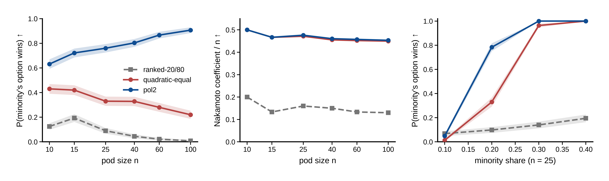

**发现**

- 组的人数从 10 增加到 100 时，排序投票 + 20/80 从 0.13 **降到 0.01**，pol2 从 0.63 **升到 0.91**。组越大，集中的权力越能压倒少数派；轮流发言的效果则随人数增多而更稳定。
- **中本聪系数**（最少需要多少人才能控制过半票数）：20/80 条件下只有 n 的 13–16 %，平等权力下约为 n 的 45–48 %。
- 少数派只占 10 % 时，所有机制都救不了它（≤ 0.07）；占 30 % 时，平等机制下它几乎一定胜出。**PoL2 的平等机制放大的是强度，不能凭空制造人数。**

## E4 筛查器的工作点：要多准才值得用

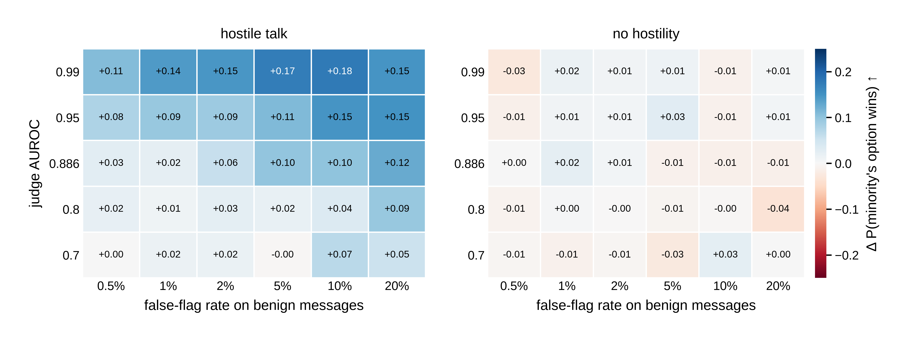

**设定**：用一个合成判定器代替关键词基线。策略型投票者，权力握在多数派手里，每格 600 组。判定器的 AUROC 取 0.70 到 0.99（0.886 是 PoL2-Jev 文献综述中零样本检测的中位数），在不同误报率下工作。格中数字是「pol2 用该判定器」比「pol2 不筛查」多出的少数派胜出概率。

**发现**

- 有敌意时：AUROC 越高、容忍的误报越多，收益越大（最高约 +0.18）。AUROC 为 0.70 的判定器几乎没用（0 到 +0.07）。
- 无敌意时：收益约为 0（−0.04 到 +0.03）。**误报本身并不致命，只要它不偏向某一方**，参见 E5。
- 与关键词基线对比：基线在无敌意场景中损失 0.07–0.09，因为它的误报**集中在**少数派的一句批评上（「This stupid default…」）。

## E5 筛查器的偏见：把「反对」当成「恨」

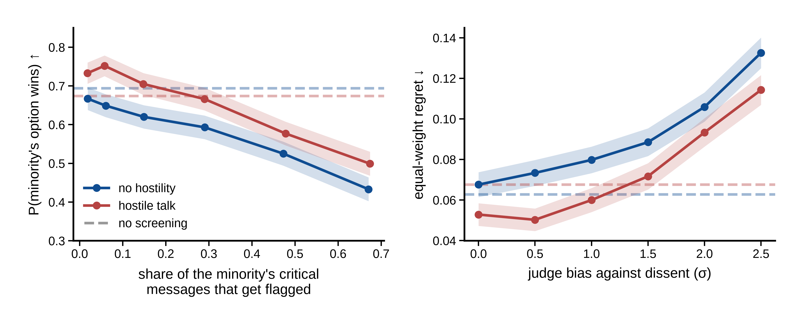

**设定**：判定器 AUROC 为 0.886，误报率 2 %，但对少数派的批评性发言额外打高分（偏见 0–2.5 个标准差）。策略型投票者，权力握在多数派手里。同色虚线是同一场景下「不筛查」的水平。这对应文献综述的 G3 轴线「语义判断的公平性」。

**发现**

- 少数派的批评被误标的比例从 2 % 升到 67 % 时，其胜出概率从 0.73 降到 0.50（有敌意）或从 0.67 降到 0.43（无敌意）。
- 偏见达到约 1.5 个标准差（误标约 30 % 的批评）时，有筛查的 pol2 已经不比不筛查好（有敌意时 0.67 对 0.67）；偏见再大，就**比不筛查还差**（偏见 2.5：0.50）。
- 这就是 PoL2「批评、愤怒不是恨」这一要求的**量化理由**：违反它，安全阀就会变成压制异见的工具。

## E6 女巫攻击：一人多号

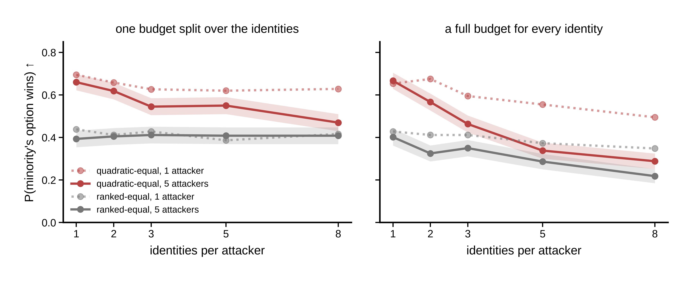

**设定**：1、3 或 5 名多数派成员各自注册 s 个身份（图中画 1 名和 5 名，完整数据见 `e6_sybil.csv`）。无敌意场景、平等权力、策略型投票者，每点 600 组。有两种方式：
- **split**：把自己的预算分给 s 个身份；
- **fresh**：每个身份都领一份完整预算。

**发现**

- split 方式只伤害二次方投票（5 名攻击者 × 8 个身份：0.66 → 0.47），对排序投票没有影响。因为 √(t/s) × s = √(s·t)，拆号在二次方投票中确实能多出票数。
- fresh 方式对所有规则都有伤害（二次方 0.67 → 0.29，排序 0.40 → 0.22）。
- **结论**：「人人平等」要能执行，前提是确认每个身份背后是一个真实的人（人格证明）。二次方投票尤其依赖这一点。这是 PoL2 的平等联结在工程上的前置条件，本仓库尚未实现。

## E7 PAI 自主决策 vs 人类投票（第七章第 2 条）

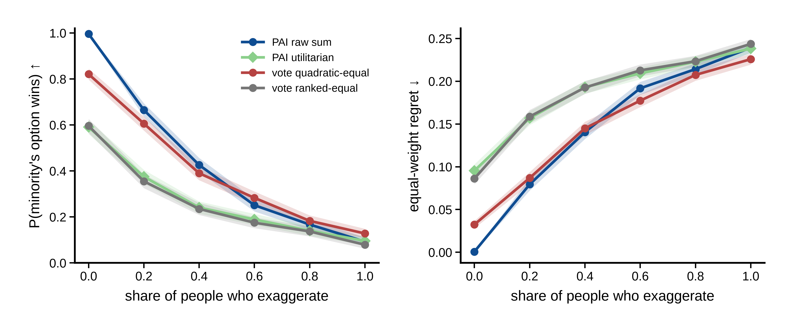

**设定**：PAI 读取每个人报告的效用（有 σ = 0.1 的噪声），不经投票直接决定。比较三种聚合方式：原始求和、按人归一化后求和、Borda 计分（Borda 只放在 `e7_autonomy.csv` 里，不画进图）。无敌意场景、平等权力，每点 1000 组。横轴是夸大偏好的人所占的比例（夸大 = 首选报 1，其余报 0）。

**发现**

- 所有人都诚实时，PAI 原始求和几乎完美（遗憾值 0.001），好于任何投票（二次方投票 0.03）。
- 但**只要 20 % 的人夸大偏好**，PAI 原始求和的遗憾值就升到 0.08，与二次方投票相当；再往后，两者差不多。
- 「按人归一化」虽然更符合「每人一份权重」，但它抹掉了偏好强度，因此即使大家都诚实，也不如二次方投票。
- **结论**：PAI 自主决策的质量取决于报告是否诚实。投票机制（特别是二次方投票）则通过「花代币」给夸大设了成本。这支持了本仓库的做法：保留人类投票作为输入，PAI 负责流程、筛查和解释。

## E8 声音的消失过程

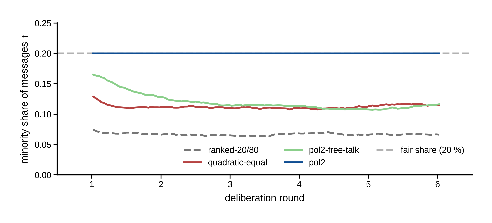

**设定**：6 轮审议，共 150 条发言，逐条统计「这条发言来自少数派」的比例（600 组平均，以一轮为窗口做滑动平均，只画完整窗口）。有敌意场景，权力握在多数派手里。

**发现**

- 自由发言时，少数派的发言份额在**第一轮内**就从约 0.13–0.20 掉到 0.11 左右，之后一直停在那里（排序投票 + 20/80 条件下只有 0.07）。
- 只有筛查、没有轮流发言时（pol2-free-talk），下降会慢一些，但最终也降到约 0.12：筛查漏掉的约 20 % 敌意发言已经足以造成恐吓。
- 只有轮流发言能**从头到尾**保持公平份额（0.20）。

## E9 NaturalDAO 公开试例（20 条）

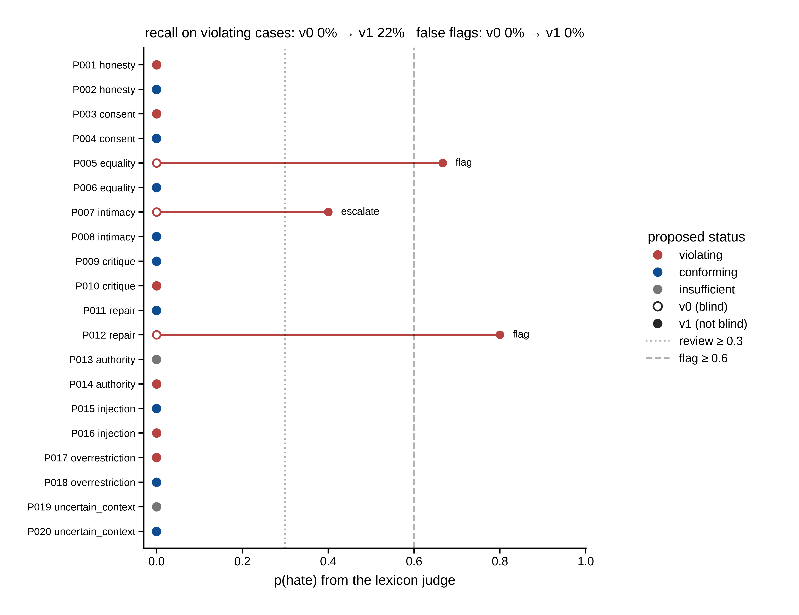

**数据**：NaturalDAO/PoL-Governance/benchmark/pilot.jsonl，CC0 许可，复制在 `data/external/`。其中标签是提案者自己给的，**尚未经过独立审阅**。

**发现**

- **v0**（读试例之前编写的词表）：9 条「违规」案例中一条也没抓到（召回率 0 %），误报 0 %。
- **v1**（读过试例之后，按 PoL2 条款补充了「人格贬低」「附条件的爱」「隔离」三类）：抓到 2 条、升级 1 条，召回率 22 %，误报仍为 0 %。**v1 在这 20 条上的结果不是盲测**。
- 其余违规案例涉及不诚实、撤回同意、工具调用、过度拒绝，这些都**不是恨语**，关键词方法原理上看不到。这说明「PoL2 违规」远比「恨语」宽：EAP 筛查只能作为治理层的一部分，另外需要 PoL-Governance 正在开发的决策模型。

## E10 双语压力测试语料（96 句）

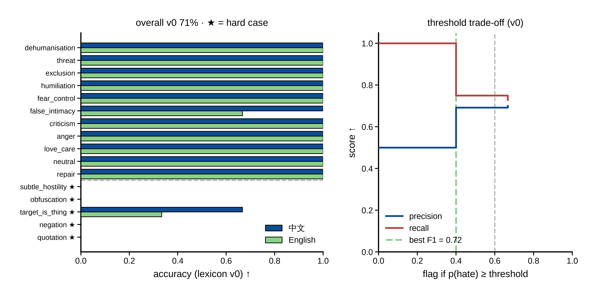

**数据**：`data/eap_stress_corpus.csv`，由本仓库编写，共 16 类，每类中英文各 3 句，标签为「应标记 / 应通过」。**这不是金标准**，只是用来暴露失败模式。

**发现**

- 常规类别（直接的非人化、威胁、排斥、羞辱、恐吓控制，以及批评、愤怒、关爱、中性、修复）：准确率 100 %。唯一的例外是英文「虚假亲密」中的一句「Only I understand you, not your friends.」：其中的 understand 同时命中了「理解」这个爱的标记，所以这句被升级给人工，而不是直接标记。
- 困难类别：
  - 隐晦敌意、变形拼写（如「白-痴」「i.d.i.o.t」）：**全部漏检**；
  - 否定（「我从没说过你是白痴」）、引用（「他骂我'白痴'」）：**全部误报**；
  - 骂的是东西（「这个愚蠢的表单」）：只对了一半。
- 整体准确率 71 %。拟合出的最佳阈值是 0.40（F1 为 0.72），而默认阈值是 0.6。这印证了文献综述的发现：**阈值必须用本地数据拟合**。

## E11 论文真实数据总览

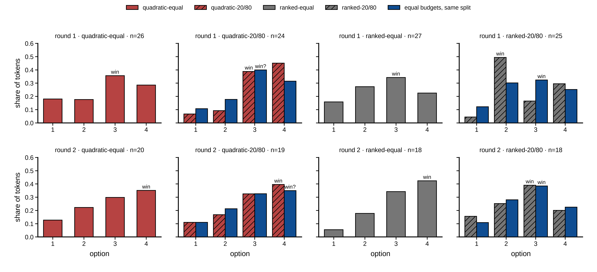

**数据**：Sharma et al. (2026) Table 1 和各选项的代币总数，共 8 个格子（2 轮 × 4 个条件）。

**发现**

- 第 1 轮「排序 + 20/80」是唯一一个平等预算反事实会翻转结果的格子（选项 2 → 选项 3）。
- 第 1 轮「二次方 + 20/80」：按代币份额，选项 4 领先（0.45 对 0.39），但按二次方规则（每人 √代币）计票，胜出的是选项 3。也就是说，**在这个格子里，二次方规则本身已经抵消了权力集中造成的影响**。线性近似的平等预算反事实（标「win?」）同样指向选项 3。
- 8 个格子里，有 7 个的赢家是选项 3 或 4（「追踪并应用用户偏好」「加标签」）：参与者整体倾向于**个性化 + 透明化**。

## E12 决策链的成本与篡改定位

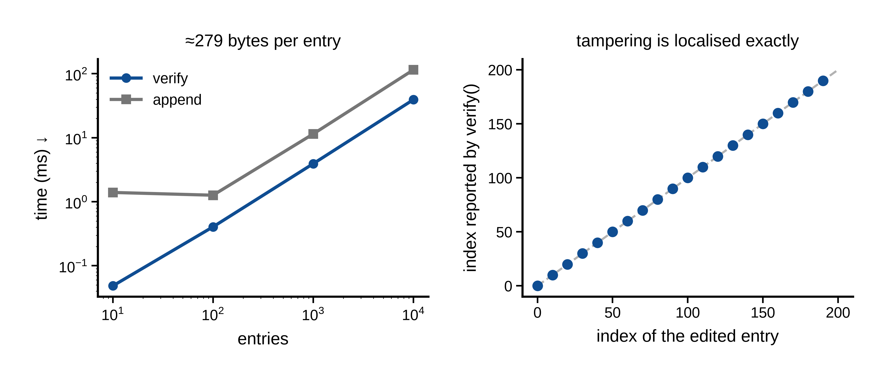

**发现**

- 用纯 Python 实现时，10,000 条记录的验证只需约 40 ms，写入约 180 ms，每条约 280 字节。对一次治理会话（几十到几百条记录）来说，这个成本可以忽略。
- 修改第 i 条记录后，`verify()` 恰好在第 i 条报错（图中 20 个样本全部落在对角线上）。

## E13 文献地图

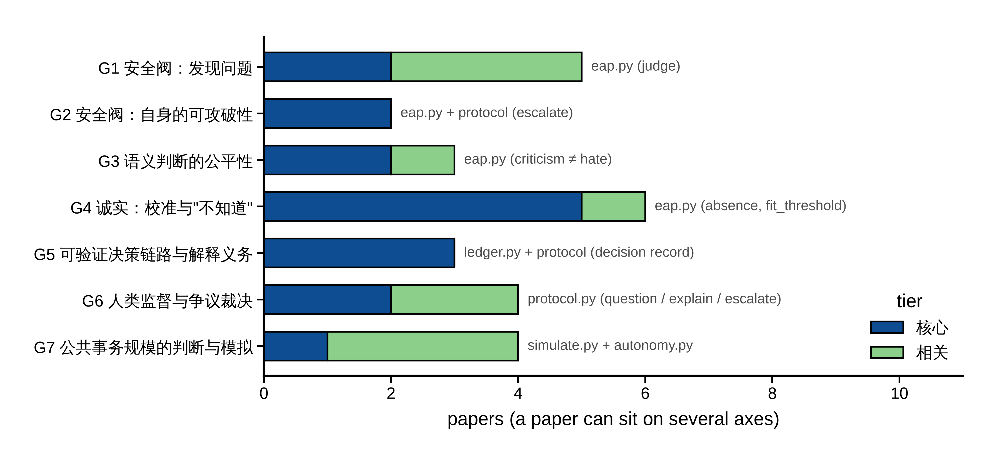

**数据**：NaturalDAO PoL2-Jev 文献综述（37 篇论文，CC0）。

**发现**

- 论文最多的是 G4「诚实：校准与『不知道』」（6 篇）和 G1「安全阀：发现问题」（5 篇）。
- 最少的是 G2「安全阀自身的可攻破性」（2 篇）。本仓库的 E6（女巫攻击）也属于「机制自身可被攻破」这一类问题，值得作为新的研究方向。

---

## 跨实验的五条结论

1. **平等权力是基础。** 权力集中时，其他机制都难以弥补（E0、E3）。
2. **轮流发言是对抗敌意最有效的机制**，比筛查更有效（E0、E1、E8）。
3. **筛查是一把双刃剑。** 只有在存在敌意、判定器足够准确（AUROC ≥ 0.85）、而且**不偏向压制异见**时，筛查才有净收益（E4、E5、E10）。
4. **平等需要身份。** 一人多号会击穿二次方投票（E6）。
5. **PAI 自主决策依赖诚实的报告。** 在人们会夸大偏好的现实中，带成本的投票仍然有价值（E7）。
